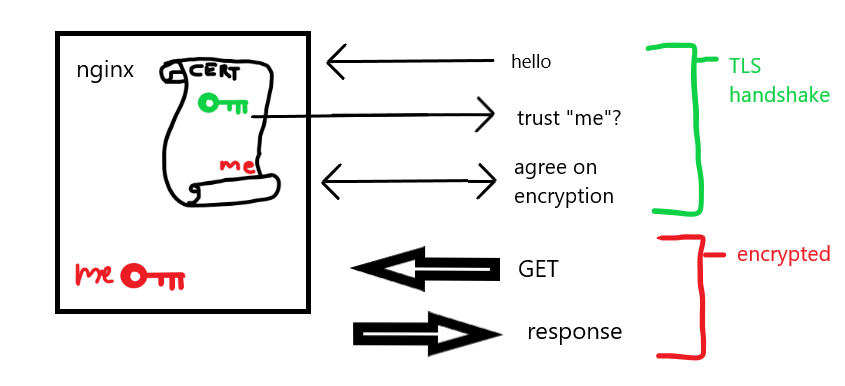

# HTTPs, with a self-signed certificate

Using a self-signed certificate, we can serve content over https.

Our setup:

Run the following commands:

    run_servers.sh

    curl https://localhost

    > curl: (60) SSL certificate problem: self signed certificate

`curl` doesn't trust the self-signed certificate used by the server.
We'll talk about trust in the next demo. For now, we can ignore certificate
problems:

    curl -k https://localhost

    # <Server response (HTML)>

You can also browse to https://localhost. You should see a security warning
in your browser. This is because the browser doesn't trust the self-signed
certificate used by the server.

The certificate is in `certificate.crt`. This was created using the
script `gen_cert.sh`.

You can use openssl to view the certificate with the following command

`openssl x509 -in certificate.crt -text -noout`

- `text`:  outputs the certificate in text format
- `noout`: disables output of the encoded certificate

You can also view the private key using openssl:

`openssl rsa -in private_key.key -text -noout`

Note that the above key is not encrypted, which makes usage easier. For
an extra layer of security, the private key can be encrypted. An encrypted
key is also generated by `gen_cert.sh`, and a demo server is run by `run_servers.sh`.
