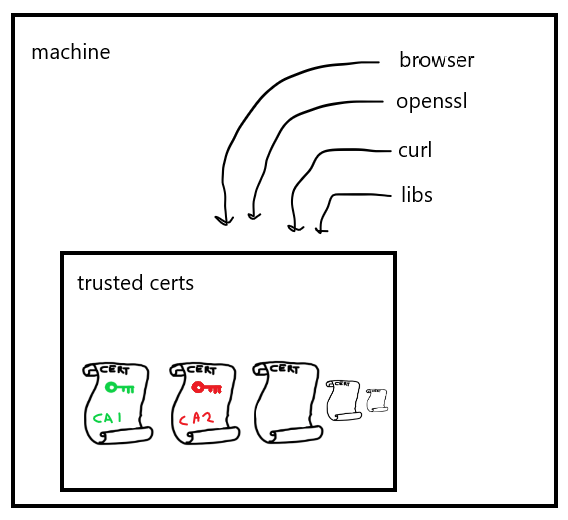

# Trusting certificates

## Why is my self-signed certificate on localhost not trusted?

When running nginx with a self-signed cert, browsers show a security warning.
Something to the effect of 'certificate issuer is not trusted'.

This is because we issued our own certificate (created and signed by us),
and the browser doesn't trust us. Machines / docker images etc. usually come
with a set of trusted certificates, and more can be installed:

It turns out that no-one trusts us, because our certificate hasn't been
installed (or 'trusted'). Assuming you're running the server from
03_https, run

`curl https://localhost -o /dev/null`

You should see

`curl: (60) SSL certificate problem: self signed certificate`

The above error is misleading, as the actual cause of the problem is that
the signature on our certificate is from an untrusted CA (us).

Similarly to web browsers, curl verifies the server certificate before 
establishing a secure connection. Certificate verification can be disabled 
with the `-k` option:

`curl -k https://localhost -o /dev/null`

Obviously this isn't a secure thing to use in practice, but it's convenient
for testing.

## Why are some websites trusted?

Now run

    curl https://en.wikipedia.org/wiki/Main_Page -o /dev/null

    > OK

This works fine - no SSL problem. Why does curl trust wikipedia's
certificate and not our self-signed one? Run

    echo "Q" | openssl s_client -connect en.wikipedia.org:443

    # simplified output
    > CN = GlobalSign, verify return:1
    > CN = GlobalSign Organization Validation CA - SHA256 - G2, verify return:1
    > CN = *.wikipedia.org, verify return:1

This is openssl verifying each certificate in the "chain" of 
certificates presented by wikipedia. A bit further down in the output,
we see `Verification: OK`. This means openssl trusts this connection.
This is because the GlobalSign certificate is trusted by the system.

To see all trusted certificates, run

    openssl version -d

    # your dir may differ
    > OPENSSLDIR: "/mingw64/ssl"

This is where openssl's configuration is. If you have a look in
/mingw/ssl/certs, you'll see `ca-bundle.crt` and `ca-bundle.trust.crt`. You
can google the difference between these files, but essentially they're
all the CAs openssl trusts.

To print out all the certificate subjects in a bundle, run

    awk -v cmd='openssl x509 -noout -subject' \
    '/BEGIN/{close(cmd)};{print | cmd}' < /mingw64/ssl/certs/ca-bundle.crt

In the output of the above, there is a subject

`OU = GlobalSign Root CA - R3, O = GlobalSign, CN = GlobalSign`

This is also seen in the certificates received from Wikipedia -
the issuer subject of the last certificate in the chain matches
the above subject. This means that the CA that issued Wikipedia's
intermediate certificate is in our list of trusted CAs, so we
can trust the intermediate certificate, thus we can trust the
server certificate.

If this were not the case, we'd see the same SSL errors when
connecting to wikipedia. We can do this with docker images that
don't come with any trusted CAs:

    docker run -it frapsoft/openssl s_client -connect en.wikipedia.org:443
    
    > Verify return code: 20 (unable to get local issuer certificate)

You can pass trusted CAs to openssl with the `CAfile` option. See
`openssl_trust_wiki.sh` for how to pass the globalsign root certificate
to openssl so that it trusts Wikipedia.

## Can we fake that our certificate was signed by GlobalSign?

From the above, it sort of looks like we could pretend to be GlobalSign by
signing our own certificate with GlobalSign's issuer name. Will this work?

In short, no. To sign a certificate, you need a private key. We can create
a CA called 'GlobalSign', but the private key will be different to GlobalSign's
private key. This will cause signature validation to fail when browsers, openssl
etc. go to check GlobalSign's signature on our certificate.

To see this in practice, see 04.01 in this directory.
