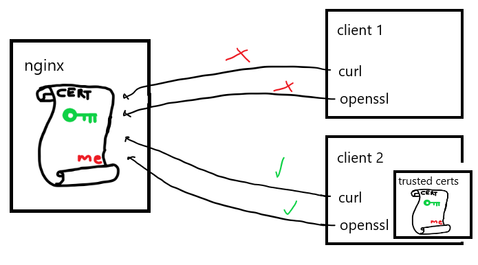

# Trusting our HTTPS server

As we saw in 04, we can instruct openssl to trust the certificate
used by our HTTPS server from 03:

    echo "Q" | openssl s_client -CAfile certificate.crt -connect localhost:443

However, rather then needing to pass our certificate to every client
that needs to talk to our HTTPS server, we can install our certificate
into the system's trusted CA store.

## Setup

Our setup will have a http server, a client that trusts no certificates, and
another client that trusts the server certificate.

`run_server.sh` fires up our trusty server, using the certificate generated
by `gen_cert.sh`. It also creates a network called `05_net` over which we
can use to communicate with the server from other containers.

Run `build.sh` to build our client docker images.

## Send requests from the clients

Now run `docker network inspect 05_net | grep IPv4Address`. Copy the value of
the IPv4Address, minus the bitmask, and use it in place of `[ip address]` in the
following commands:

    docker run -it --network 05_net uozuaho/sslcurl_no_trust curl [ip address]

You should see the welcome page from the nginx server. Now run

    docker run -it --network 05_net uozuaho/sslcurl_no_trust curl https:/[ip address]

You should see an error about certificate locations. This is because the
uozuaho/sslcurl_no_trust docker image doesn't come with any trusted ssl certificates.

You should see the 'self signed certiciate' error from openssl:

    docker run --network 05_net uozuaho/sslcurl_no_trust \
        sh -c "echo 'Q' | openssl s_client -connect <container ip>:443"

An 'official' site like Wikipedia will also not be trusted, as the client docker image
has been stripped of all the standard trusted certificate authorities:

    docker run --network 05_net uozuaho/sslcurl_no_trust \
        sh -c "echo 'Q' | openssl s_client -connect en.wikipedia.org:443"

    > ...
    > Verify return code: 20 (unable to get local issuer certificate)
    > ...

Now let's try the client that trusts our server certificate:

    docker run --network 05_net uozuaho/sslcurl_trust_us \
        sh -c "echo 'Q' | openssl s_client -connect <container ip>:443"

curl will fail with `certificate subject name 'my_common_name' does not match target host name '172.23.0.2'`.
This is because the common name (CN) in our certificate doesn't match
the host section of our server's url. Fixing this is beyond the scope
of my interest.
