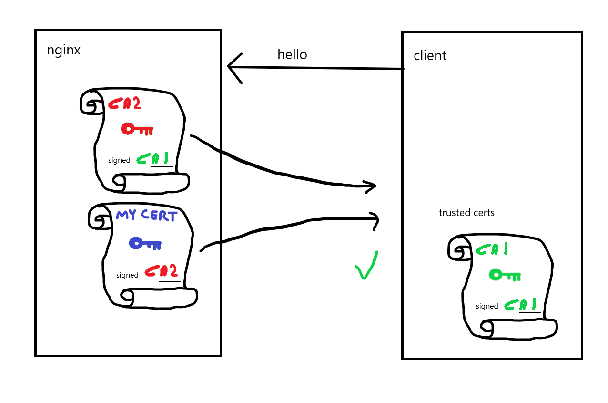

# Certificate chains, intermediate certificates

The widely used X.509 certificate specification defines 'certificate chains'. A
certificate chain is a sequence of certificates, with each certificate in
in the sequence having been signed using the previous certificate's private
key. Since the first certificate in the sequence has no previous certificate,
it is signed using its own private key. There is no security benefit in this;
the certificate format requires that a signature be present,

The reason for the concept of the chain, is that rather than having to install
thousands of trusted certificates, clients can trust a smaller number of
'Certificate Authorities (CA)', which can sign server certificates in a 
cryptographically secure way. This way, if a client receives a server certificate
that was signed by a CA they trust, then they will also trust the server
certificate.

Read more at https://en.wikipedia.org/wiki/X.509.

# This demo

Certificates setup:

- Root:           UozuSign root
- Intermediate:   UozuSign intermediate   (signed by root)
- Server:         uozuaho.com.crt         (signed by intermediate)

The server sends the server and intermediate certificate, and the client trusts
the root certificate.

Run `run_server.sh` to start our HTTPS server. Now run
`echo "Q" | openssl s_client -CAfile certs/uozusign_root.crt localhost:443`.
This should succeed. Note that trusting the intermediate or server certificate
certificate will fail:

`echo "Q" | openssl s_client -CAfile certs/uozusign_intermediate.crt localhost:443`
`echo "Q" | openssl s_client -CAfile certs/uozuaho.com.crt localhost:443`

This is because by default, openssl expects the last certificate in the chain
to be a self-signed CA certificate in its trusted CA list. Thus, the server must
send the certificate chain to _at least_ the penultimate intermediate CA. Excluding
the root certificate from the chain is quite common, as it must be trusted a priori
by the client.

It seems reasonable that clients should be able to be configured to trust an
intermediate CA, however it seems that expecting the self-signed root CA is common
behaviour. See https://security.stackexchange.com/questions/17391/can-an-intermediate-ca-be-trusted-like-a-self-signed-root-ca

# Some notes

This took a while to figure out. Have a look at certs/gen_certs.sh for some notes
on the work that was required for this demo to succeed. In short:

- The intermediate cert must be labelled as a 'CA', otherwise openssl won't trust it
- Make sure nginx is configured to send the certificate chain, not just the server
  certificate. If you just send the server cert, the client has no way of knowing
  that the intermediate that signed the server cert was actually signed by the trusted
  root certificate, thus will not trust the connection.
